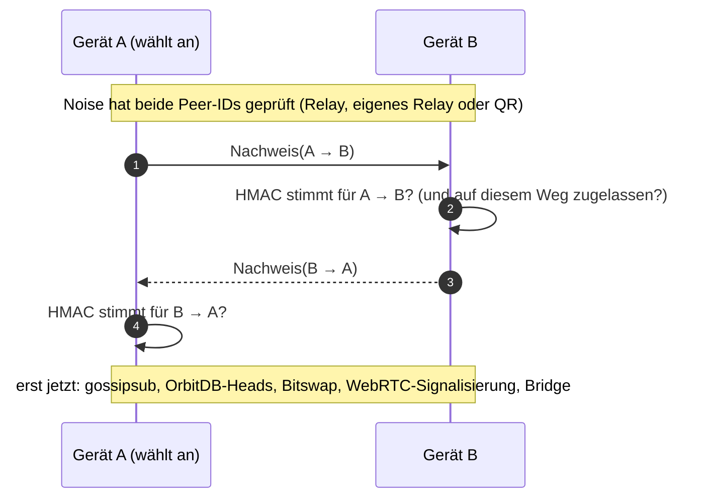

# Der Gerätenachweis: nur eigene Geräte bekommen die Bücher

_English: [device-proof.md](device-proof.md)_

Ist „Eigene Geräte synchronisieren“ an, geht der Knoten, der die Bücher abgleicht, ins Netz: über ein Le-Space-Relay, über ein Relay in der eigenen Bridge oder direkt nach zwei gescannten QR-Codes. Wer seine Peer-ID kennt, kann ihn erreichen – das Relay, oder wer den QR-Code des Geräts gesehen hat. Die Einträge sind versiegelt, bevor sie geschrieben werden, aber OrbitDB gibt seine Heads und Bitswap seine Blöcke jedem Peer, der fragt. Deshalb beweist ein Peer erst, dass er denselben Passkey hat, bevor er irgendetwas bekommt.

Der Code: [`app/src/lib/sync/device-gate.js`](../app/src/lib/sync/device-gate.js), daneben [`first-contact.js`](../app/src/lib/sync/first-contact.js), [`quiet-identify.js`](../app/src/lib/sync/quiet-identify.js) und [`qr-link.js`](../app/src/lib/sync/qr-link.js).

## Der Nachweis

Beim Entsperren leitet Belege aus der PRF-Antwort des Passkeys einen Schlüssel ab: `deviceAuthKey = HKDF-SHA-256(PRF-Antwort, "belege/device-auth/v1")` ([`database-keys.js`](../app/src/lib/database-keys.js)). Jedes Gerät mit demselben Passkey kommt auf denselben Schlüssel. Er wird nie übertragen und nie gespeichert.

Verbinden sich zwei Geräte, beweist das anwählende zuerst, über das Protokoll `/belege/device-proof/1.0.0`:

```
Nachweis = HMAC-SHA-256(deviceAuthKey, "belege/device-proof/v1\n" + Peer-ID des Beweisenden + "\n" + Peer-ID des Prüfenden)
```



Bis ein Peer den Nachweis erbracht hat, antwortet ihm der Knoten nur mit identify, dem Circuit-Relay und dem Nachweis selbst. Ein libp2p-Dienst, der als erster startet, umhüllt die Registry: Jeder andere Protokoll-Handler wartet bis zu zehn Sekunden auf den Nachweis und bricht den Stream ohne ihn ab, und die Topologien von libp2p (gossipsub, Bitswap) erfahren erst nach dem Nachweis von dem Peer. Scheitert ein Austausch, versucht der Geräte-Sync es in jeder Runde neu, solange ein bekanntes Gerät verbunden ist.

## Was ein Relay oder ein Fremder sieht

- **identify:** Ein Peer ohne Nachweis, jedes Relay eingeschlossen, erfährt nur identify und die Relay-Protokolle. Die Datenbanken (OrbitDB legt je Datenbank ein Protokoll mit ihrer Adresse im Namen an), gossipsub, Bitswap, die WebRTC-Signalisierung und die Extensions, die ein Rechner den eigenen Geräten anbietet, werden einem Gerät erst nach seinem Nachweis genannt. Der Knoten nennt sich `js-libp2p` statt des User-Agents des Browsers ([`quiet-identify.js`](../app/src/lib/sync/quiet-identify.js)).
- **Das Protokoll des Nachweises** wird nur Geräten angeboten, nicht einem Relay, das der Knoten anwählt, und nicht angekündigt: Sein Name verriete, welche App hinter einer Peer-ID steckt.
- **Was bleibt:** dass zwei Peer-IDs verbunden sind, wann, und wie viele Bytes fließen. Das Relay trägt die mit Noise verschlüsselte Verbindung und kann sie nicht lesen.

## Welche Geräte hereinkommen

- Der Eintrag eines Geräts in den Büchern (`device:<Peer-ID>`) sagt, wen der Knoten anwählt. Ein Eintrag allein gibt nichts: Eine versehentlich eingetippte Peer-ID wird angewählt, erbringt nie den Nachweis und bleibt „nicht verbunden“.
- **„Beides“** (öffentliche Relays und eigenes Netz): Ein Gerät, das die Bücher noch nicht kennen, kommt nur über das eigene Netz herein – über eine Verbindung aus zwei gescannten QR-Codes oder über das Relay der Bridge. Sobald sein Eintrag repliziert ist, darf es auch über die öffentlichen Relays kommen. Wer mit einem geleakten Passkey aus der Ferne ein Gerät hinzufügt, bekommt nichts ([`first-contact.js`](../app/src/lib/sync/first-contact.js)).
- In den anderen Modi kommt jedes Gerät herein, das den Passkey beweist.
- **Die Bridge zwischen eigenen Geräten** (`belege-bridge`) antwortet einem Peer nur, wenn die Bücher ihn als eigenes Gerät kennen _und_ er auf dieser Verbindung den Passkey bewiesen hat; ein Telefon ruft nur Geräte an, die ihn bewiesen haben.
- **Ein Gerät entfernen** löscht seinen Eintrag; jedes Gerät legt auf und lässt es von da an nicht mehr herein.

## Warum das sicher ist

- **Ohne Passkey kein Nachweis.** Der Schlüssel kommt aus der PRF-Antwort des Passkeys, die nur der Authenticator erzeugen kann. Eine Peer-ID zu kennen – aus einem QR-Code, einem Screenshot, vom Relay – reicht nicht.
- **Ein Nachweis gilt nur für ein Paar von Peers.** Er nennt beide Peer-IDs, und das sind die, die Noise mit den eigenen Schlüsseln der Peers geprüft hat (auf dem QR-Weg binden das signierte WebRTC-Angebot und die Antwort den DTLS-Fingerabdruck ebenso an beide Peer-IDs). Ein anderswo mitgelesener oder weitergereichter Nachweis ist wertlos: Auf jeder anderen Verbindung sind die Peer-IDs andere. Mitlesen geht ohnehin nicht, die Verbindung ist durchgehend verschlüsselt.
- **Standardbausteine.** HMAC-SHA-256 mit einem 256-Bit-Schlüssel aus HKDF; geprüft wird mit `crypto.subtle.verify`.
- **Der Inhalt ist sowieso versiegelt.** Jeder Eintrag und jede Belegdatei wird versiegelt (AES-256-GCM, jedes Mal eine frische Nonce), bevor sie geschrieben wird. Der Nachweis hält die versiegelten Bücher, ihre Namen und ihren Änderungsrhythmus von Peers fern, die keine eigenen Geräte sind; er ersetzt das Versiegeln nicht.

## Grenzen

- Wer den Passkey hat, ist ein eigenes Gerät. Er könnte die Bücher ohnehin öffnen.
- Ein Gerät zu entfernen beendet seinen Abgleich, nicht seinen Zugang: Mit dem Passkey kann es die Bücher öffnen, die es hat.
- Der Nachweis zeigt den Passkey, nicht welches Gerät: Zwei Geräte mit demselben Passkey unterscheidet er nicht; das tun die Einträge in den Büchern.
- Die Einträge von OrbitDB sind mit der `data`-Schicht versiegelt (der Inhalt). Die `replication`-Schicht, die den ganzen Eintrag verschlüsselt, wird noch nicht genutzt; mit ihr sähe ein Peer, der am Tor vorbeikäme, nicht einmal Identität, Uhr und Verweise eines Eintrags.

## Tests

[`device-gate.spec.js`](../app/src/lib/sync/device-gate.spec.js) lässt echte libp2p-Knoten über den Memory-Transport laufen: Zwei Geräte desselben Passkeys bekommen Daten und gossipsub; ein Peer ohne Tor und einer mit anderem Passkey bekommen nichts, ob sie anwählen oder angewählt werden; ein gescheiterter Austausch wird neu bewiesen. Die End-to-End-Tests für Geräte-Sync und Bridge laufen über ein lokales Relay durch das Tor.
