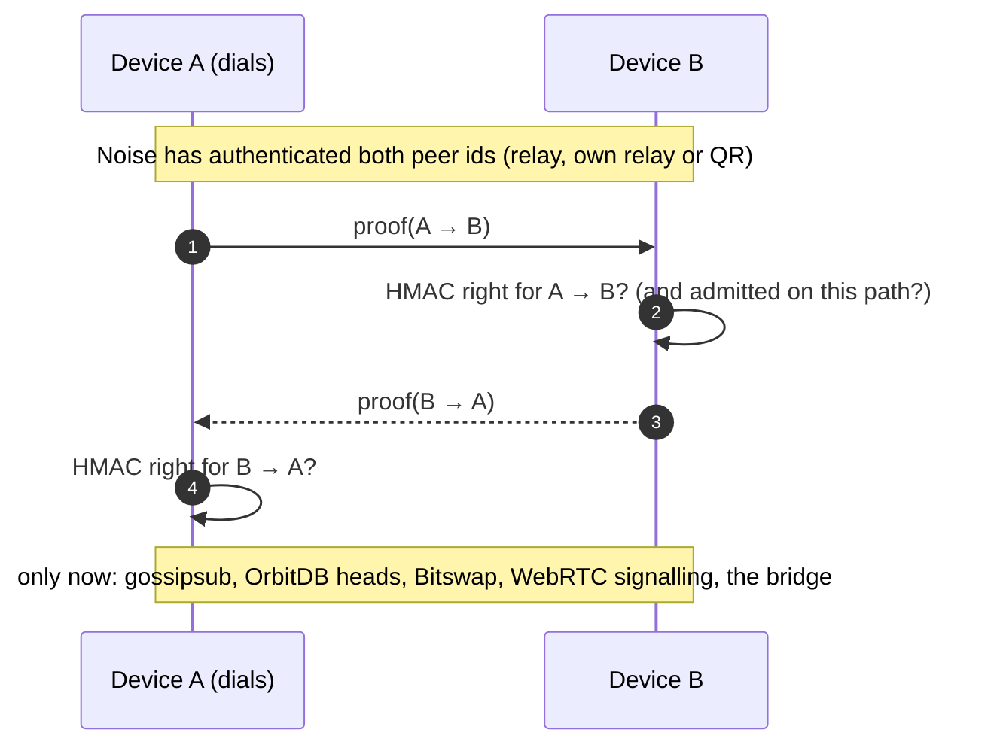

# The device proof: only own devices get the books

_Deutsch: [device-proof.de.md](device-proof.de.md)_

With "Eigene Geräte synchronisieren" on, the node that syncs the books goes online: through a Le-Space relay, a relay in the own bridge, or directly after two scanned QR codes. Anyone who knows its peer id can reach it — the relay, or whoever saw the device's QR code. The entries are sealed before they are written, but OrbitDB hands its heads and Bitswap its blocks to every peer that asks. So before a peer gets anything, it proves that it holds the same passkey.

The code: [`app/src/lib/sync/device-gate.js`](../app/src/lib/sync/device-gate.js), with [`first-contact.js`](../app/src/lib/sync/first-contact.js), [`quiet-identify.js`](../app/src/lib/sync/quiet-identify.js) and [`qr-link.js`](../app/src/lib/sync/qr-link.js) next to it.

## The proof

At unlock, Belege derives a key from the passkey's PRF answer: `deviceAuthKey = HKDF-SHA-256(PRF answer, "belege/device-auth/v1")` ([`database-keys.js`](../app/src/lib/database-keys.js)). Every device of the same passkey gets the same key. It is never sent and never stored.

When two devices connect, the one that dialled proves first, on the protocol `/belege/device-proof/1.0.0`:

```
proof = HMAC-SHA-256(deviceAuthKey, "belege/device-proof/v1\n" + prover's peer id + "\n" + verifier's peer id)
```



Until a peer has proved it, the node answers it only with identify, the circuit relay and the proof itself. A libp2p service listed first wraps the registrar: every other protocol handler waits up to ten seconds for the peer's proof and aborts the stream without it, and libp2p's topologies (gossipsub, Bitswap) learn of the peer only after its proof. If an exchange fails, device sync tries again each round while a known device is connected.

## What a relay or a stranger sees

- **identify:** a peer that has not proved the passkey, every relay included, is told identify and the relay protocols only. The databases (OrbitDB registers one protocol per database, with its address in the name), gossipsub, Bitswap, WebRTC signalling and the extensions a desktop serves its own devices are named to a device after its proof. The node calls itself `js-libp2p`, not the browser's user agent ([`quiet-identify.js`](../app/src/lib/sync/quiet-identify.js)).
- **The proof's protocol** is offered to devices only, not to a relay the node dials, and not announced: its name would tell which app is behind a peer id.
- **What remains:** that two peer ids are connected, when, and how many bytes flow — the relay carries the Noise-encrypted connection and cannot read it.

## Which devices are let in

- A device's record in the books (`device:<peer id>`) says whom to dial. A record alone gives nothing: a peer id typed in by mistake is dialled, never proves, and stays "nicht verbunden".
- **"Beides"** (public relays and the own network): a device the books do not know yet is let in only over the own network — a connection built by two scanned QR codes, or one through the bridge's relay. Once its record has replicated, it may come over the public relays too. A device someone adds from far away with a passkey that leaked gets nothing ([`first-contact.js`](../app/src/lib/sync/first-contact.js)).
- In the other modes, any device that proves the passkey is let in.
- **The bridge between own devices** (`belege-bridge`) answers a peer only if the books know it as an own device _and_ it proved the passkey on this connection; a phone calls only devices that proved.
- **Removing a device** deletes its record; every device hangs up on it and refuses it from then on.

## Why it is sound

- **Without the passkey, no proof.** The key comes from the passkey's PRF answer, which only the authenticator can produce. Knowing a peer id — from a QR code, a screenshot, the relay — is not enough.
- **A proof is bound to one pair of peers.** It names both peer ids, and those are the ones Noise authenticated with the peers' own keys (on the QR path, the signed WebRTC offer and answer bind the DTLS fingerprint to both peer ids the same way). A proof read or relayed elsewhere is worth nothing: on any other connection the peer ids differ. Reading it is not possible either: the connection is encrypted end to end.
- **Standard parts.** HMAC-SHA-256 under a 256-bit key from HKDF; the check is `crypto.subtle.verify`.
- **Content is sealed anyway.** Every entry and every receipt file is sealed (AES-256-GCM, a fresh nonce each) before it is written. The proof keeps the sealed books, their names and their rhythm of change away from peers that are not own devices; it does not replace the sealing.

## Limits

- Whoever holds the passkey is an own device. They could open the books anyway.
- Removing a device ends its syncing, not its access: with the passkey it can open the books it has.
- The proof shows the passkey, not which device: two devices of one passkey cannot be told apart by it; the records in the books name them.
- OrbitDB's entries are sealed with the `data` layer (the payload). The whole-entry `replication` layer is not used yet; with it, a peer that slips past the gate would not even see an entry's identity, clock or links.

## Tests

[`device-gate.spec.js`](../app/src/lib/sync/device-gate.spec.js) runs real libp2p nodes over the memory transport: two devices of one passkey get the data and gossipsub; a peer without the gate and one with another passkey get neither, dialling or dialled; a failed exchange is proved again. The device-sync and bridge end-to-end tests run through the gate over a local relay.
